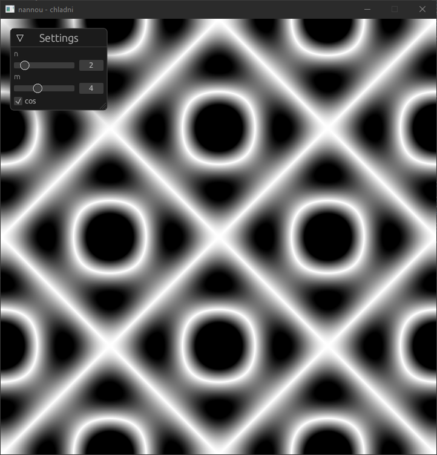

When watching [Steve Mould's 2022 video about Chladni figures](https://youtu.be/rjueHI002Fg), I wanted to make a more interactive digital version. This is it. I got the formulas from his video, thanks Steve!

Here's a preview of the program:

